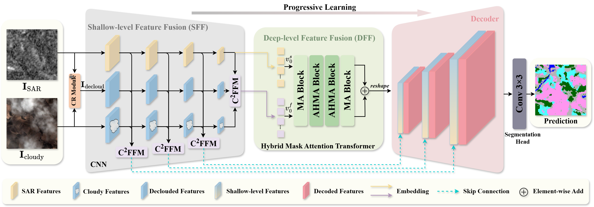

# PLCSeg: SAR-guided Progressive Learning for Semantic Segmentation of Cloudy Remote Sensing Images

This repository contains the official implementation of:

> **PLCSeg: SAR-guided Progressive Learning for Semantic Segmentation of Cloudy Remote Sensing Images**
> 
>  GIScience & Remote Sensing (2026)



*Figure 1. Overall framework of the proposed PLCSeg.*

## Usage

### Training

Run the following command to train the model:

```bash
python trainseedMaskDice.py
```

### Testing

The testing code will be released after the project is fully organized.

## Citation

If you find this project useful for your research, please cite our paper:

```bibtex
@article{PLCSeg,
  title={PLCSeg: SAR-guided Progressive Learning for Semantic Segmentation of Cloudy Remote Sensing Images},
  author={},
  journal={},
  year={}
}
```
